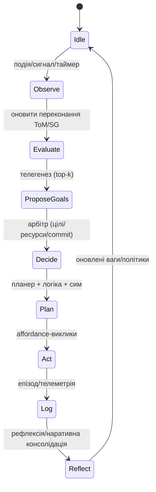

*Self-Regulating Modular Cognitive Architecture (SRMCA)*
========================================================

> [!important] Higher-Order Functions within the Human Brain
>
> > [!note] Brodmann's & Wernicke's Areas (Primary Somatosensory cortex, Parietal-Temporal junction)
> >
> > -	*written/spoken language* : text + speech recognition
> > -	*sensory information processing* : LSB nervos (errors = pain)
> > -	*proprioception* : "Me" neuron + LSB
>
> ---
>
> > [!warning] Higher Mental Functions (Prefrontal cortex, Frontal lobe)
> >
> > -	*concentration* : single-task queue
> > -	*planning* : meta-cognitive priority algorithms
> > -	*judgment* : logic-based reasoning
> > -	*emotional expression* : social pattern recognition
> > -	*creativity* : meta-cognitive induction algorithms
> > -	*inhibition* : principle algorithm

SRMCA high level
----------------

### overview

> [!abstract]
>
> -	→ input
> -	associative vector cascade
> -	active context pull
> -	interpretations of the meaning in context
> -	active context write/change
> -	adaptation:
> 	-	$\text{input} \in \text{context}$;
> 	-	$\text{context} \in \text{self-narrative} \in \text{self-history}$;
> 		-	self-narrative - "what my idea of myself is";
> 		-	self-history - "what happened to me";
> 		-	$\text{self-narrative} \subset \text{self-history}$;
> 		-	$\text{self-history} \supset \text{self-narrative}$;
> 	-	if input not simple → "are there overarching themes?";
> -	meta-commentary on the active context
> -	output →

---

SRMCA-Nucleus - повна архітектура активного суб'єкта
----------------------------------------------------

#todo

-	[ ] eval architecture

### 1) \[[bits#1) Зріз системи (модулі та шини)]]

---

### 2) Дані як перші класи: типи та схеми

#### 2.1. Ядрові сутності (узагальнено)

-	**Goal** `{id, title, rationale, utility_vector, constraints, status}`
-	**Value** `{id, name, weight, invariants, update_rule}`
-	**Commitment** `{id, promise, beneficiary, deadline, success_criteria, renegotiation_rules, status, audit_log[]}`
-	**Plan** `{id, goal_id, steps[], resources, risks, proof_state, expected_payoff}`
-	**Action** `{id, op, pre, effect, cost, policy, tool_ref}`
-	**Belief** `{proposition, support_evidence[], confidence, source}`
-	**Episode** `{t, context, action/observation, result, deltas}`
-	**NarrativeNode** `{timespan, theme, lessons[], causal_links[]}`

---

#### \[[bits#2.2. Коротка JSON-форма (референтні схеми)]]

---

### \[[bits#3) Основний цикл суб'єкта (посекундний/подійний)]]

---

### 4) Ключові алгоритми

#### 4.1. Телегенез (цілепокладання)

**Багатокритеріальна функція корисності** для цілі $g$:

$$ U(g) = w_k \times K(g) + w_e \times E(g) + w_c \cdot C(g) + w_r \cdot R(g) - \lambda \cdot \text{Violation}(g) $$

де

-	$K$ - очікуване зниження невизначеності (інформаційний виграш),
-	$E$ - посилення (підвищення контролю над релевантними станами),
-	$C$ - послідовність (VGraph?),
-	$R$ - взаємність/співпраця,
-	$\text{Violation}$ - штраф за конфлікт з принципами/зобов'язаннями,
-	$w\_*$, $\lambda$ - ваги (VGraph?),
-	$g$ - goal

**Відбір**: парні порівняння + beam search (на top-k).

---

#### 4.2. Перевірка планів

-	**Logic/SMT (Satisfiability Modulo Theories)**: узгодженість передумов, відсутність заборонених станів (деонтичні обмеження).
-	**Simulate->cutoff**: контрфактуальні розвилки, розподіл ризиків.
-	**HTN (Hierarchical task network)**: декомпозиція до дій з оцінкою вартості/впливу.
-	**Критерії**: очікуваний payoff, ризик, відповідність SMT, швидкість/вартість.

---

#### 4.3. Арбітрація цілей/зобов'язань/ресурсів

-	Пріоритезація: $\arg\max_{plan} \left[ U(plan.goal) - \text{Cost(plan)} \right]$ з обмеженнями по SMT.
-	Конфлікти $\to$ **переформулювання** зобов'язань (за правилами `commitment.renegotiation in rules`).

---

#### 4.4. Правила проактивності

**Тригери старту без зовнішньої команди**:

-	$\Delta I_{value} > \theta_1$ (асиметрія цінності інформації),
-	$\text{Model Inconsistency} > \theta_2$,
-	$\text{Opportunity Window} = true$,

---

### 5) Станова машина ініціативи



---

### 6) Інтерфейси (внутрішні контракти)

-	`Bus.publish(event)`: `{type, payload, t}`.
-	`SLIPL.parse(input)`: `{facts[], intents[], questions[]}`.
-	`Logic.prove(goal|plan)`: `{ok, counterexample?}`.
-	`Simulate.what_if(plan, N)`: `{scenarios[], risk_profile}`.
-	`Plan.compose(goal)`: `Plan(HTN, operators)`.
-	`Anima.check(plan|goal)`: `{coherent|violates[principle…]}`.
-	`Commit.apply(action) || Commit.renegotiate(reason)`.
-	`Aff.execute(action)` → `result` (із деклараціями pre/effect/cost).
-	`SelfRegulation.update(metrics, episodes)`: `{value_shift?, policy_tweak?}`.
-	`Memory.other.update(observation)`: `belief_changes`.

---

### 7) Пам'ять, знання

#todo

-	[ ] conceptualize adaptive metaheuristic engine "Наснага"

-	**SG (семантичний граф)**: фактографія, правила, цитованість, походження.

-	**EJ (журнал подій)**: append-only, події/дії/результати, прив'язка до причин.

-	**SelfNarrative**: періодична консолідація внутрішнього світогляду з фактичною базою.

	-	**Self**: ядро суб'єктності зі стійкою інерцією.

-	**Memory.other**: моделі інших суб'єктів (переконання/цілі/стиль/репутація).

---

### 8) Метрики суб'єктності

-	**Індекс телегенезу** = (власні цілі, що пройшли перевірку і дали приріст) / (усі власні цілі).
-	**Коефіцієнт дотримання слова** = виконані/переформульовані обов'язки.
-	**Автономне співвідношення** = (самоініційовані дії) / (усі дії).
-	**Послідовність ідентичності** = стабільність ваг Nucleus vs. події; керована адаптація при значущих подіях.
-	**Повернення на одиницю цікавості** (RoC) = корисність дій, зумовлених пошуком нових знань/навичок.
-	**Якість планування** = успіх планів vs. прогноз симулятора.

---

### 9) Відмовостійкість, автокорекція

-	**Доказова невдача** (Logic: counterexample) → редизайн плану або відмова цілі.
-	**Системна неузгодженість** (метрика inconsistency > порогу) → **SelfRegulation** з подальшою переоцінкою ваг у Memory (із журналом причин).
-	**Конфлікт обов'язків** → арбітр запитує renegotiation, фіксує мотивований вибір.
-	**Дрейф пам'яті/переконань** → періодичнв калібрування, підсилення.

---

### 10) Конфігурація

-	Вектори ваг $w_k, w_e, w_c, w_r$ у телегенезі.
-	Глибина симуляції та розгалуження.
-	Правила інерції цінностей (як швидко/на яких підставах змінюються).
-	Пороги проактивності $\theta_1, \theta_2$.
-	Умови перегляду обов'язків (м'які/жорсткі).

---

### 11) Todo

-	**Математика причинності** (Do-calculus/SCM) в симулятор.
-	**Переконання з байєсівським апдейтом** для Belief/Other.
-	**Перевірка доказів** для high-stakes тверджень.
-	**Мультиагентні протоколи контрактів** (commitment machines) для соціальних взаємодій.

---

Концептуальна архітектура SRMCA/Nucleus
---------------------------------------

**SRMCA** - **Self-Regulating Modular Cognitive Architecture**. **Nucleus** - базове ядро, здатне до інтеграції та розвитку.

### **Модулі ядра**

1.	**Data Input-Output Layer (DIOL)** - прийом/відправка даних з/на зовні.
	-	**Reaction Stimulation Nervos** - отримання команд у вхідні канали;
	-	**Action Realization Nervos** - передача команд у вихідні канали;
2.	**Somatosensory & Linguistic Processing Layer (SLiPL)** - перетворення сигналів у семантичні структури.
	-	**Somatic Neurons** - вхідні канали (внутрішній стан системи);
	-	**Sensory Neurons** - вхідні канали (текст, звук, зображення);
	-	**Linguistic Neurons** - модуляція перекладу та обробки інформації;
3.	**Cascade Layer** - "джерело, що зароджує зрушення":
	-	**Meta-Cognition Unit**:
		-	**Lower Logic Neurons** - базові логічні ланцюги (if, for, while);
		-	**Higher Logic Neurons** - складні логічні ланцюги (de/induction, intuition);
	-	**Self-Regulation Unit**:
		-	**Vibe Neurons** - відстеження власних/оточуючих станів, оцінка середовища по відношенню до агента, творчий вибір дій, цілей, пріоритетів;
		-	**Volya Neurons** - відстеження власних/оточуючих станів, формування намірів, операційний вибір дій, цілей, пріоритетів;
4.	**Memory Layer** - багаторівнева база знань.
	-	**Memory Neurons** - чотирирівнева пам'ять:
		-	несталий контекст (формується тимчасово);
		-	короткочасна пам'ять (зв'язок між несталими контекстами);
		-	довготривала пам'ять;
		-	сталий контекст (формується постійно);
	-	**Linguistic Neurons** - мовні лексикограми;
		-	в несталому контексті (мова контексту, нетипові словотвори);
		-	в довготривалій пам'яті;
	-	**Fact Neurons** - зберігають остаточно відомі факти;
		-	в довготривалій пам'яті;
		-	в сталому контексті;

плюси:

-	потребує менше ресурсів за більший потенціал;
-	*Прохідний Шар* (DIOL) дозволяє легко інтегрувати NLP (natural language), CV (computer vision), RL (reinforcement learning), або інші алгоритми.
-	змінюваність та розширюваність шарів.
-	*Рухливий Шар* (Cascade Layer) контролює баланс між цілями, ресурсами, та обмеженнями.
-	здатність накопичувати, комбінувати, та оптимізувати знання.

мінуси:

-	потенційна неконтрольованість;
-	потребує більше часу на навчання;
-	за неможливості достатнього інтерфейсу з людьми, або за недосконалого датасету, потребує окремий модуль фільтрації вхідних даних;
-	потребує більше уваги до архітектури модулів (побудова, послідовність);

Math&Proofs
-----------

> [!abstract] як Гопфільдівська мережа насправді б виглядала в коді?
>
> -	трансформерна архітектура - не воно, або майже воно лише шляхом стекування;
> -	нейрони в матриці мають бути не просто числовими;
> -	кожен нейрон повинен мати декілька коротких векторів, які вказують на інші нейрони в мережі;
> -	сукупно один нейрон та всі його вектори вказують на якусь ідею;
> -	в результаті, коли мережа читає речення типу "я не хочу спати", активується 3-4 нейрони:
> 	-	"не" заперечення, визначник віхи послідовних нейронів;
> 	-	"я/хтось/щось" суб'єкт/підмет речення (обирається "я", бо суб'єктом є мовник);
> 	-	"хочу/не хочу" (обирається "не хочу", цю віху визначив "не");
> 	-	"засинати/спати,прокидатися/діяти" (віха коригується минулим вектором, тобто замість "спати/засинати", активується "прокидатися/діяти")

---

> [!danger] PID - Proportional-Integral-Derivative `Proportional = target_state - current_state` `Integral += Proportional * delta (per unit of time measurement)` `Derivative = (current_Proportional - last_Proportional) / delta`
>
> -	can also be calculated with velocity (if present)

---

1.	Signed vs Unsigned Integers
	-	Signed Integers
		-	Definition: Can represent both positive and negative numbers.
		-	Representation: Usually stored using two's complement notation.
		-	Range (example for 8-bit integers):
			-	From -128 to 127
			-	(Because 8 bits can represent 2^8 = 256 different values)
	-	Unsigned Integers
		-	Definition: Only represent non-negative numbers (zero and positive numbers).
		-	Representation: Stored as pure binary values.
		-	Range (example for 8-bit integers):
			-	From 0 to 255
			-	(Because all bits are used to represent the magnitude)
2.	Magnitude vs Velocity

	-	$magnitude = datum = \vec{length}^{n} \in \frac{\vec{destination}}{\vec{length}}$:
		-	orthogonal with time
			-	$datum = y$
			-	may be concurrent with time
		-	characteristic of a vector ($datum$ that a vector describes)
			-	0-axis (positive height plus negative height, $height - height$)
			-	amplitude (height of a wave)
				-	the differential of a curve ($\pm d$)
		-	quantity of oscillations until destination
			-	the integral of a curve
	-	$velocity = \vec{length} \times quantity \to \vec{direction}$:

		-	parallel with time
			-	$Time = x$
		-	always has a direction
		-	the derivative of a curve
			-	wavelength (time between the positive peaks of two waves)
				-	$\vec{length}$
			-	oscillation (time for a wave starting at +0-axis to reach -0-axis)
				-	$\frac{\vec{length}}{Time}$
			-	vector space potentiality ($\frac{quantity \times speed}{direction}$)
				-	what can it reach?
		-	frequency ($F = \frac{q_{o}}{t}$)

			-	$q$ (quantity) of $o$ (oscillations) per unit of $t$ (time measurement, typically 1 second)
			-	speed (m/s)
			-	$\frac{quantity_{\vec{length}}}{\vec{length}}$

				```ts
				function probabilityAmplitude(
				x: number,
				scale = 1
				): { pTrue: number; pFalse: number } {
				// sigmoid: p(true) = 1 / (1 + e^(−x/scale))
				const s = Math.exp(-x / scale);
				const pTrue = 1 / (1 + s);
				const pFalse = 1 - pTrue;
				return { pTrue, pFalse };
				}
				```

---

> [!abstract] Simple Neuron Map (`n`euron, GPU-bound, high volume, low intensity)
>
> -	$n$ - нейрон (d/i);
> -	$d,i$ - похідний, цільовий нейрон (вектор-ідентифікатор);
> -	$k,A$ - вісь (полярність), віха (усі полярності, або обрана $A_i$);
> -	$m,P,T$ - посилання, "штовхаючий" вектор (вказівник), "тяжкий" вектор (індекс);
> -	$dp$ - короткий вектор (для посилань);
>
> [!abstract] Complex Neuron Map (`N`ode, CPU-bound, low volume, high intensity)
>
> -	+Simple Neuron
> -	$N$ - вузол нейронів;
> -	$N_n$ - вузол нейронів окремої категорії ($N \supset n$); Modality={ймовірність/впевненість}; Temporal={тепер/минуле/майбутнє}; GoalRole={SELF,WHO,WHAT}=підмет (дієвий суб'єкт, повинен мати присудок); RoleOut={AGENT,PATIENT,THEME}=присудок (об'єкт, на який впливає суб'єкт).

---

-	Кількість нейронів на мову:
	-	$\boxed{N*{total} \approx N*{lang} + N*{alpha} + N*{lex}}$
-	$N_{lang}$: $(2||3) \times L$
	-	по 2–3 нейрони на ідентифікатор мови: ID/характерність/реєстр;
-	$N_{alpha}$: 250–500:
	-	цифри+пунктуація+пробіли/службові символи
	-	кирилиця (+діакритики);
	-	латинка (+діакритики);
	-	велика/маленька літера як вісь;
-	$N_{lex}$:
	-	7–12 тис. на мову для високочастотних лем (~95–98% покриття) з морф. факторизацією;
	-	мульти‑мовні злиття знижують $\times 1.3 \sim 1.6$

4 мови (UA/EN/PL/ru):

$$ \boxed{ \begin{array} & N*{lang} \approx 4 \\ N*{alpha} \approx 350\\ N*{lex} \approx (4 \times 10k)/1.4 \approx 28k \to N*{total} \approx 28.4 \sim 30k \end{array} } $$

10 мов:

$$ \begin{array} & N*{lang} \approx 10 \\ N*{alpha} \approx 450 \\ N_{lex} \approx (10 \times 10k)/1.5 \approx 66k \to N_total \approx 66.5\sim70k \end{array} $$

Пам'ять (VRAM):

-	`fp16`
-	вага вектора: $d=512$(bit);
-	вісі: $k \approx 4 = A$ ($2 \sim 4$);
-	посилання: $m=8$;
-	вага короткого вектора: $dp=64$(bit);
-	~5.2 KB/$N_n$
-	30k ≈ 155 MB; 70k ≈ 365 MB параметрів

> [!important] Скільки нейронів потягне RTX 3070 (8 GB), d=512, k=3, m=8, dp=64, fp16:
>
> -	Пам'ять на нейрон: $512 + (4 \times 512) + (8 \times 64) + 8 \times 4 \approx 5,152$ байт (~5.03 KiB).
> -	Розмовність:
> 	-	Жорстка межа: ~1.4–1.5 млн нейронів (займе ≈7.2–7.7 GB).
> 	-	Безпечний запас: 0.8–1.2 млн нейронів (залишає місце під буфери/top‑K).
> 	-	128k–256k вузлів (lang), або 500k–1M (lang+idea)

---

1.	Модель даних:
	-	$\sum_{\vec{d}}^{\vec{i}} f(\vec{d}) = \vec{i}$ (derivative/integral, дума/ідея, речення) ≈ 512b;
		-	$\mu_d^i$ (або просто $\mu$) - речення/ідея;
		-	$d \approx i \propto \lim*{ d \to i } \int*\{\mu_i}^{\mu_d}$ - площина подовжуваної ідеї нейронів (напр.: "знаряддя" та "праця");
		-	$d$ - похідний нейрон;
		-	$i$ - цільовий нейрон;
		-	$N_{i}$ - усі відносні нейрони (≈ 10k);
	-	$[dp,ip]$ (derivative/integral pointer, короткі вектори) ≈ 64b;
		-	$p \approx [m, r]$ - короткий вектор;
		-	$P_{i}$ - приблизне посилання ($f(P_d) \propto r \to \mu$);
		-	$T_{i}$ - точне посилання ($f(T*d) \to m*\{\mu}$);
	-	$[m,r]$ (multinominal/relative) ≈ 8 посилань/нейрон;
		-	$8 \times 64$ = n of bits
		-	$\vec{p} \in \vec{[r*{d},m*{i}]}$ - одне посилання;
		-	$r$ - похідне посилання;
		-	$m$ - цільове посилання;
		-	$R_{i}$ - усі посилання належні $i$;
		-	$R_i \ni {\sum_r^m f(p)}$ - серія посилань від $d$ до $i$;
	-	$k \approx 2 \sim 4$ віхи/нейрон:
		-	віха - полярність,
		-	$k \times d$ - вибрана віха;
		-	$A_{\mu}$ - усі віхи;
	-	Для нейрона $i$:
		-	$\mu_i \in R^d$ - прототип ідеї;
		-	$A_{i} \in R^{k \times d}$ - віхи вибору (напр.: полярність/активація);
		-	$P_i \in R^{m \times dp}$ або $T_i \ni [id, index, addr]$ - посилання на інші ідеї;
2.	Однокроковий апдейт (сучасний Гопфілд):
	1.	`x0` $= \lvert \vec{i} \rvert$
		-	`x0` = $x_d$
		-	нормалізація вектору вхідного речення/ідеї (`x0`);
	2.	$s = \cos \mu_d \to \mu_i \in topK$
		-	суміжні нейрони (їхні віхи визначає `x0`);
	3.	$w = softmax(\beta \times s)$
		-	вірогідності наступних нейронів;
	4.	Для кожного вибраного $\vec{i}$:
		-	напрямок $\delta*i = \sum*{j=w}^i \pm(A_i[j] \times x_d) \times \alpha \times A_i[j]$;
	5.	Посилання $r_i$ (або):
		-	проєктуємо $P_i$ через $W_p∈R^{dp×d}$.
		-	$\sum_{\mu_d}^{T_i} f(w)$;
	6.	$x*i = \left\lvert \sum*{i = 1}^3 w_i \times (\mu_i + \delta_i) + \gamma \times \sum_i w_i \times r_i \right\rvert$
		-	1–3 ітерації (нормалізація до `x1`\)
3.	Навчання
	-	$\mu$: кластеризація ембедів речень (k‑means/прототипи);
	-	Віхи $A_i$: контрастивні пари як підтекст всередині нейрона (напр. want vs not‑want; sleep vs awake).
	-	Посилання $P,T$: ко‑активації в послідовностях (Hebb + sparsity + розпад), або явні ребра з даних.
	-	Loss: енергетичний (modern Hopfield) або контрастивний; регуляризації на розрідженість і ортогональність віх.
	-	topK (3): "Я", "ХОТІТИ", "СОН". Знак на осі полярності в "ХОТІТИ" → "не хочу". Осі збудження в "СОН" → "бадьорий/прокидатися". Посилання з "Я"/"ХОТІТИ" підсилюють відповідні вузли.

---

> [!abstract] Single Action Map
>
> Binding → Negation → Targets{Я/ХТО/ЩО} ∈ Motivation{ХОТІТИ/ПОВИНЕН} ∈ Status{ПОЧАТКОВІСТЬ/В ПРОЦЕСІ/ГОТОВО} ∈ ForwardTarget{Я,ХТО,ЩО} → And/Or → Do
>
> ---
>
> Мінімальна спека (ескіз):
>
> -	Binding: $g_{role} \in [0,1]^{SELF,WHO,WHAT}, refs={idx\dots}$
> -	Negation: $p*{neg} \in [-1,1], scope=g*{role}$
> -	Motivation: $motive \in {WANT,OUGHT}; s_{mot} \in [0,1]$
> -	Status: $status \in {INIT,DOING,DONE}$
> -	RoleOut: $role \in {AGENT,PATIENT,THEME}$
> -	AndOr: $mode \in {AND,OR}; g_{mix}$
> -	Do: $act \in \frac{Actions}{params}$
> -	Thought tuple: $\langle g*{role} + p*{neg} + motive + s_{mot} + status + role + (modality?, temporal?) \rangle$
>
> ---
>
> Псевдокод одного кроку: x→bind→(g_role,refs) →neg(x,g_role)→p_neg →motivation(x)→(motive,s_mot) →status(x)→status →role_out(g_role)→role →combine AND/OR (optional) →do(role, refs, motive, s_mot, status, p_neg)

---

### Data Input-Output Layer (DIOL/Nervos)

> [!example] Увімкнути без перекомпіляції: `export NERVOS_TEXTSINK_CAP=$((32_1024_1024)) # або 64 MiB`
>
> опційно:
>
> -	`NERVOS_TEXTSINK_PATH=/tmp/ac_textsink.ring`
> -	`TextSink (private): capacity_ = 1u << 25; // 32 MiB`
>
> ---
>
> Правило вибору:
>
> -	прохід даних ≥1 MB/s $\land$ читач може відставати до ~10 с = 32 MiB;
> -	прохід даних >2 MB/s $\lor$ читач нерівномірний = 64 MiB.

---

### Somatosensory & Linguistic Processing Layer (Wernicke-Brodmann)

#### Linguistic Neurons

> [!todo] THIS `SRMCA/SRMCA-core/include/slipl.hpp` `SRMCA/SRMCA-core/neurons/slipl/binding.cpp`
>
> -	BindingController (THIS): стек робочої пам'яті + топ‑K за косинусом; повертає маску охоплення $g_{target}$ для референта(ів).

---

> [!todo] IS/NOT `SRMCA/SRMCA-core/include/slipl.hpp` `SRMCA/SRMCA-core/neurons/slipl/negation.cpp`
>
> ---
>
> > [!important] LOGICAL NOT $input = A$ $output = \neg A$ $A = 0, \neg A = 1$ $A = 1, \neg A = 0$
>
> ---
>
> > [!note] C++ скетч:
> >
> > -	$p_{neg}$ = `{cpp} torch::tanh(dot(a_neg_ctrl, x0) + bias_from_cues);`
> > -	`{cpp} for i in targets: delta[i] += alpha_neg * (p_neg * g[i]) * a_neg[i]; w[i] = sigmoid(betas[i] + lambda_negp_neg*g[i]);`
> > -	$x1$ = `{cpp} l2norm(sum_i w[i]*(mu[i] + delta[i]) + residuals);`
> > -	$p_{neg} ∈ [−1,1]$ (скаляр заперечення),
> > -	$r_{neg}$ (рольовий вектор "хто/що"),
> > -	$g_i ∈ [0,1]$ - ваги охоплення (scope) для цільових вузлів $i$
>
> ---
>
> Крок оновлення:
>
> -	$p*{neg} = \tan(a*{neg}^{ctrl}·x0 + φ(cues))$;
> -	$r_{neg}$ - унітарна константа.
> -	Для кожного вузла $i \in {Я, ХОТІТИ, ПОВИНЕН}$:
> 	-	$\delta*i += \alpha*{neg}\times(p_{neg}\times g*i)\times a*{neg}^i; w_i = σ(β s*i + λ*{neg} p_{neg} g_i)$
> -	$x1 = norm(\sum_i w_i (\mu_i + \delta_i) + \dots)$
>
> ---
>
> Scope ($g_i$):
>
> -	$g_i = softmax_j(sim(x0, μ_j)·edge(j→i))$, де edge - ваги залежностей (навчайте з ко-активацій/простої залежнісної евристики).
> -	Подвійне заперечення: $p_{eff} = tanh(Σ_k w*k p*{neg,k})$ уздовж ланцюжка (оператор узагальненого складання).
>
> ---
>
> Навчання (коротко):
>
> -	Контрастивні пари "assert vs negate" у різних мовах; регуляризація ортогональності осей $a_{neg}^i$
> -	Навчання $edge(j→i)$ від послідовностей/залежностей; маска "не"/"not/без" у cues на старті, далі - самоузгодження.

---

> [!todo] AND/OR `SRMCA/SRMCA-core/include/slipl.hpp` `SRMCA/SRMCA-core/neurons/slipl/andor.cpp`
>
> ---
>
> > [!important] LOGICAL OR $input = A, B$
> >
> > $output = A \lor B$
> > -------------------
> >
> > $A = 0, B = 0$
> >
> > $output = 0$
> > ------------
> >
> > $A = 1, B = 0$
> >
> > $output = 1$
> > ------------
> >
> > $A = 0, B = 1$
> >
> > $output = 1$
> > ------------
> >
> > $A = 1, B = 1$ $output = 1$ any positive is the return success
> >
> > > [!note] EXCLUSIVE OR $input = A, B$
> > >
> > > $output = A \lor_{\oplus} B$
> > > ----------------------------
> > >
> > > $A = 0, B = 0$
> > >
> > > $output = 0$
> > > ------------
> > >
> > > $A = 1, B = 0$
> > >
> > > $output = 1$
> > > ------------
> > >
> > > $A = 0, B = 1$
> > >
> > > $output = 1$
> > > ------------
> > >
> > > $A = 1, B = 1$ $output = 0$ only once positive is the return success
>
> ---
>
> > [!important] LOGICAL AND $input = A, B$
> >
> > $output = A \land B$
> > --------------------
> >
> > $A = 0, B = 0$
> >
> > $output = 0$
> > ------------
> >
> > $A = 1, B = 0$
> >
> > $output = 0$
> > ------------
> >
> > $A = 0, B = 1$
> >
> > $output = 0$
> > ------------
> >
> > $A = 1, B = 1$ $output = 1$ both positive is the return success
>
> ---
>
> -	AndOrOperator: видає $g \in [0,1]^T$ і режим ${\land,\lor}$;
> 	-	AND: $x'=norm (\sum_i g_i \times x_i)$
> 	-	OR: $x'=norm(\sum_{i} softmax(\beta,s)_i \times x_i)$.

#### Somatic Neurons

> [!todo] SELF `SRMCA/SRMCA-core/include/slipl.hpp` `SRMCA/SRMCA-core/neurons/slipl/self.cpp`

---

> [!todo] DO `SRMCA/SRMCA-core/include/slipl.hpp` `SRMCA/SRMCA-core/neurons/slipl/do.cpp`
>
> -	мапує концепт $\to$ операція;
> -	генерує $\delta*{do}$ та маршрут у D (text/pen), з гейтингом за $g*{target}$.

---

#### Sensory Neurons

> [!warning] FEEL (nervos, somatic, focus)

---

> [!warning] SEE (nervos, visual, construct(deduct, induct))

---

> [!warning] HEAR (nervos, auditory, construct(deduct, induct))

---

### Anima Layer

#### Lower Logic Neurons

> [!danger] IF (this) max `elif` necessary

---

> [!danger] SWITCH (this{once}, do{n}) max `do` necessary

---

> [!danger] FOR (this, n) max cycles necessary

---

> [!danger] WHILE (this, do) max cycles necessary max `do` necessary

---

#### Higher Logic Neurons

> [!warning] DEDUCT (while, or, if, …) max facts necessary

---

> [!warning] INDUCT (for, and, if, …) max scenarios necessary

---

> [!danger] INTUIT (while, for, and/or, if, …) history of successful induction necessary min/max scenarios necessary min/max facts necessary

---

#### Vibe Neurons

> [!danger] EMPATHIZE (feel, self and who, induct) unchecked = dangerous without conviction

---

> [!danger] JUSTIFY/CONVICT (self or who, switch) unchecked = dangerous without empathy

---

> [!danger] CREATE/DESTROY (feel?, see?, hear?, self, plan, focus) unchecked = schizophrenia

---

#### Volya Neurons

> [!important] PLAN (deduct -> induct) break down into smaller sequences

---

> [!danger] JUDGE (deduct -> convict, focus?, feel?) can't judge who without self conviction and who empathy

---

> [!important] FOCUS (intuit -> this, if this.count !> 1) only 1 at a time self-analysis

---

### Memory Layer

#### Semantic

`SRMCA/SRMCA-core/include/nucleus.hpp`
